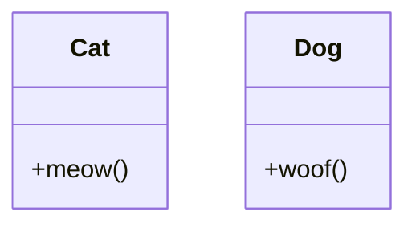
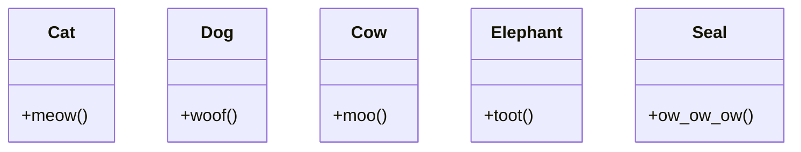
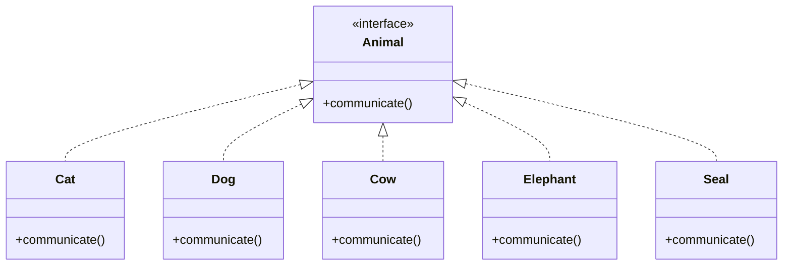

# Factory Method

## Problem



From the class diagram above, we have two animals with its own communication method. To make them communicate, look at the following code

```
Cat bluestar = new Cat()
Dog oberon = new Dog()
bluestar.meow()
oberon.woof()
```

It seems that there is no problem at all, but what if there are a hundred kinds of animals and you need all of them to communicate (I only list out ten animals, imagine the difficulty of developing  with more and more animals)



```
Cat bluestar = new Cat()
Dog oberon = new Dog()
Cow minotaurus = new Cow()
Elephant pennington = new Elephant()
/* stefano is a sea lion, I just can't find any seal characters */
Seal stefano = new Seal()
bluestar.meow()
oberon.woof()
minotaurus.moo()
pennington.toot()
stefano.ow_ow_ow()
```

## Solution

The idea behind Factory Method is to create an interface that fits all kinds of methods and leave the implementaion details to the classes that implements the interface. By doing so, we don't need to care if the object is a Dog, Cat ...etc, we simply call the method and let the functions override in the subclass? do the work.



```
Animal bluestar = new Cat()
Animal oberon = new Dog()
Animal minotaurus = new Cow()
Animal pennington = new Elephant()
/* stefano is a sea lion, I just can't find any seal characters */
Animal stefano = new Seal()
bluestar.communicate()
oberon.communicate()
minotaurus.communicate()
pennington.communicate()
stefano.communicate()
```

## Reference

[初探設計模式 by Daniel Wu](https://ithelp.ithome.com.tw/users/20112528/ironman/2113)

[Factory Method](https://refactoring.guru/design-patterns/factory-method)

[What Does The Fox Say](https://www.youtube.com/watch?v=jofNR_WkoCE)